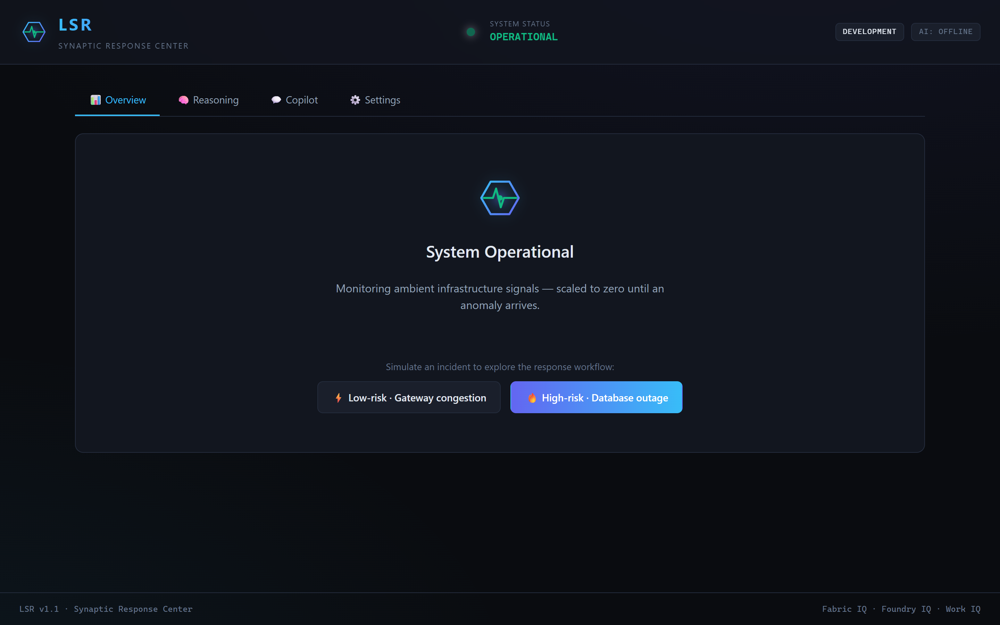
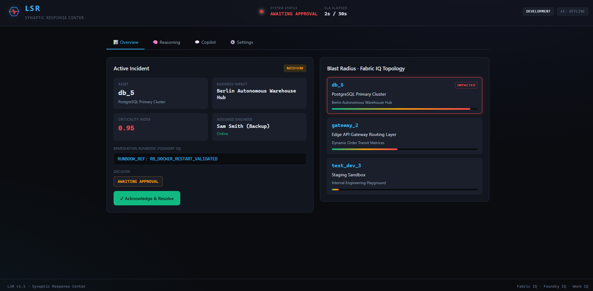
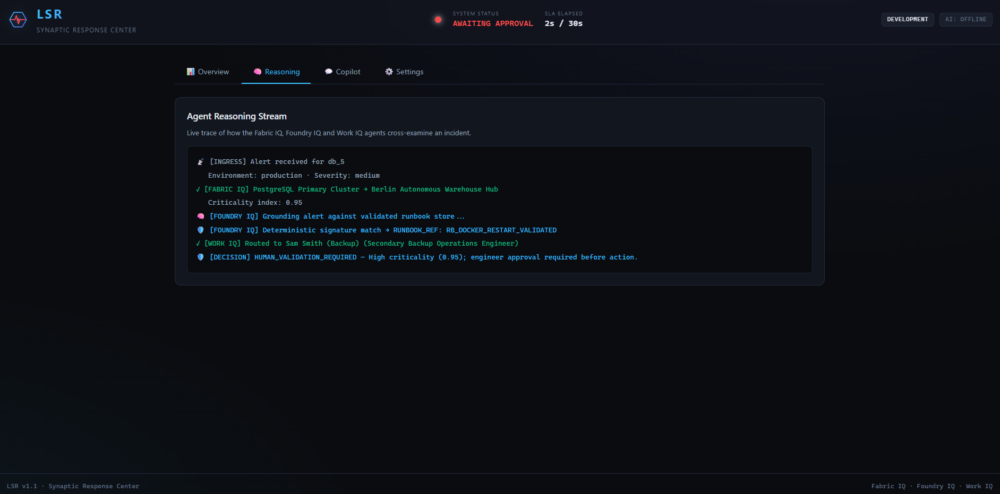
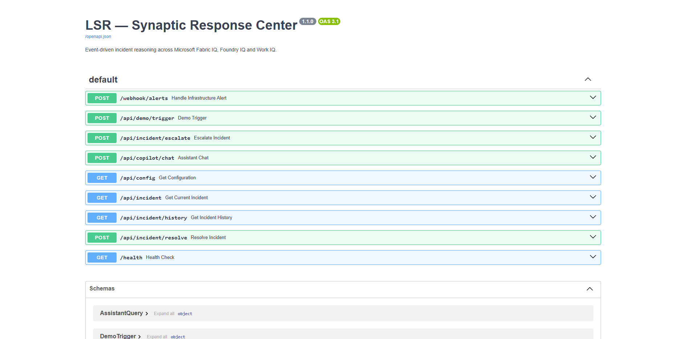
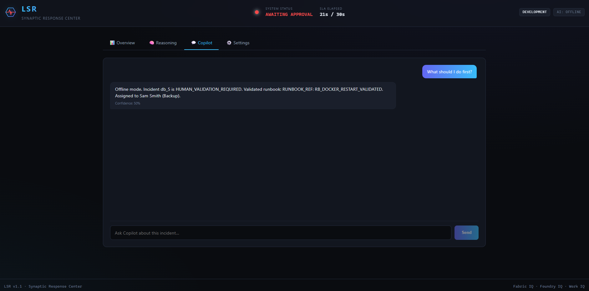
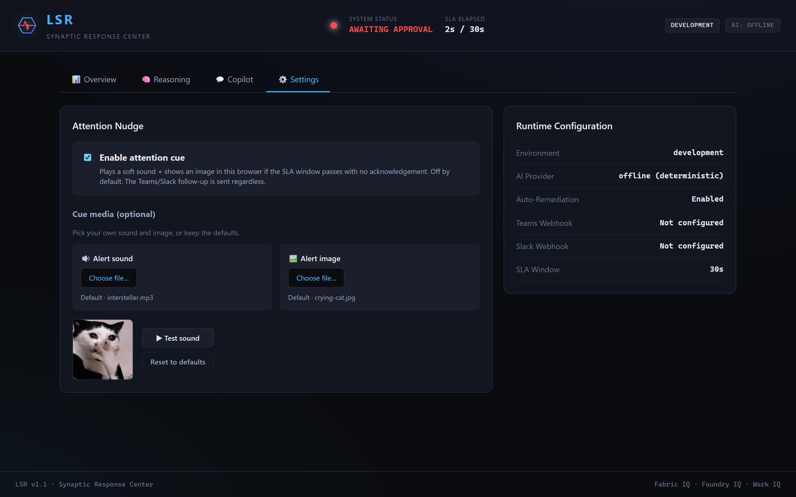

<div align="center">


# LAURA: Synaptic Response · LSR 

**An event-driven, AI-assisted incident response engine that turns raw
infrastructure alerts into grounded, business-aware decisions – and routes them
to the right engineer, calmly.**

Built for the **Agents League Hackathon** · Reasoning Agents track ·
integrates **Microsoft Fabric IQ · Foundry IQ · Work IQ**


</div>

<div align="center">

</div>

---

## Table of contents

- [What it does](#what-it-does)
- [Why it's different](#why-its-different)
- [Architecture](#architecture)
- [Quick start (demo — zero config)](#quick-start-demo--zero-config)
- [Connecting an AI model](#connecting-an-ai-model)
- [Connecting Teams / Slack](#connecting-teams--slack)
- [Corporate / production deployment](#corporate--production-deployment)
- [Security](#-security--responsible-ai)
- [Project structure](#project-structure)
- [Troubleshooting](#troubleshooting)

---

## What it does

When an infrastructure alert arrives, LSR reasons across three layers and decides
how to respond – automatically for low-risk issues, with a human in the loop for
high-risk ones.

| Layer | Microsoft IQ | Responsibility |
|-------|--------------|----------------|
| **Business context** | **Fabric IQ** | Maps the failing asset to the business process it supports and its criticality (blast radius). |
| **Knowledge / grounding** | **Foundry IQ** | Matches the alert to a *validated* remediation runbook. Never invents one. |
| **People / routing** | **Work IQ** | Finds the best available on-call engineer by live presence + calendar. |

The decision gateway then chooses one of:

- **Auto-remediation** – low criticality + a validated runbook → execute a safe,
  signed runbook reference (sandboxed, no shell-out).
- **Human validation** – high criticality → route an Adaptive Card to Microsoft
  Teams / Slack and wait for acknowledgement.
- **SLA escalation** – if no one acknowledges within the SLA window, send a calm
  follow-up nudge (plus an optional, opt-in attention cue in the dashboard).


<div align="center">

</div>

---

## Why it's different

- 🧠 **Multi-agent reasoning** – a transparent Fabric IQ → Foundry IQ → Work IQ
  pipeline, with the full reasoning trace visible in the UI.
- 🔌 **Vendor-neutral AI** – works with **Azure OpenAI / Azure AI Foundry**,
  **OpenAI**, or any **local OpenAI-compatible runtime** (Ollama, LM Studio,
  vLLM). Ships a **deterministic offline mode** so it runs with *zero* config and
  *zero* external calls – perfect for demos and CI.
- 🛡️ **Safe by construction** — AI agents are structurally decoupled from
  execution; only a fixed allow-list of validated runbook tokens can ever run.
  Anti-hallucination is enforced in code, not just in the prompt.
- 🔔 **Meets engineers where they are** – Microsoft Teams Adaptive Cards + Slack.
- 🎨 **Polished control center** – React dashboard with the LSR emblem, live
  blast-radius topology, an agent reasoning stream, and a grounded Copilot chat.
- 🐳 **Production-minded** – containerised (non-root), health-checked, optional
  API-key auth, and shaped to mirror **Microsoft Foundry Hosted Agents**.

<div align="center">

</div>

---

## Architecture

```
[ Infrastructure Alert ] ─▶ POST /webhook/alerts
                                  │
                      ┌───────────▼───────────┐
                      │   LSR Reasoning Core   │  (FastAPI)
                      └───────────┬───────────┘
            ┌─────────────────────┼─────────────────────┐
            ▼                     ▼                      ▼
      📊 Fabric IQ          🧠 Foundry IQ           💼 Work IQ
   business blast        grounded validated       available on-call
   radius + criticality      runbook                  engineer
            └─────────────────────┼─────────────────────┘
                                  ▼
                        Decision Gateway
              auto-remediate │ human-validate │ escalate
                                  │
                 ┌────────────────┼────────────────┐
                 ▼                ▼                 ▼
         Teams / Slack     Dashboard UI      Audit trail
         Adaptive Card    (live reasoning)   (history)
```

---

> [!Note]
>
> This project was created for the **Microsoft Agents League 2026** hackathon. It
> is a working prototype, built with genuine care, but on a tight deadline – so
> it may contain imperfections. Focused on making the
> core idea **real, safe, and genuinely useful**.
>
> If something doesn't work perfectly, please do let me know, I'd
> love to improve it. Thank you for taking the time to explore LSR. **I really
> hope you enjoy it.** 💙

---

## Quick start (demo – zero config)

LSR runs fully offline with deterministic
reasoning, so a curious developer can see it working in two minutes.

**Prerequisites:** Python **3.10–3.13** · Node.js **24.16.0 – 26.3.0** (24 LTS recommended)
*(Python 3.14 may need a C/Rust compiler for some packages – 3.12
is the smoothest.)*

### 1. Backend – the reasoning engine

```bash
cd reasoning-agent
python -m venv .venv
# Windows:        .venv\Scripts\activate
# macOS / Linux:  source .venv/bin/activate
pip install -r requirements.txt

uvicorn app:app --reload --port 8000
```

The backend is the engine – it has no page of its own, but it ships an
**interactive API explorer** (Swagger UI) where you can browse and try every
endpoint live:

👉 **http://localhost:8000/docs**

<div align="center">

</div>

### 2. Frontend – the dashboard

```bash
cd creative-visualizer
npm install
npm run dev
```

Open the printed URL (default `http://localhost:5173`).

### 3. See it work

On the idle screen, click **Simulate Incident** (low- or high-risk). Watch the
blast-radius topology, the agent reasoning stream, and the decision posture
update live.

Prefer the terminal? `cd reasoning-agent && python demo.py`.

---

## Connecting an AI model

LSR is **vendor-neutral**. Without a model it uses deterministic reasoning; add
one to enable grounded runbook matching and the live Copilot chat. Configuration
is via environment variables in a git-ignored `.env` file:

```bash
cd reasoning-agent
cp .env.example .env      # then edit .env
```

Pick **one** provider:

### Azure OpenAI / Azure AI Foundry  *(recommended for the Microsoft stack)*
```ini
LSR_LLM_PROVIDER=azure
LSR_LLM_BASE_URL=https://<your-resource>.openai.azure.com
LSR_LLM_API_VERSION=<put_date_here>
LSR_LLM_MODEL=<your-deployment-name>
LSR_LLM_API_KEY=<your-key>
```

### OpenAI
```ini
LSR_LLM_PROVIDER=openai
LSR_LLM_API_KEY=<your-key>
LSR_LLM_MODEL=<your_model_name>
```

### Local model (Ollama / LM Studio / vLLM) – no key, runs on your machine
```ini
LSR_LLM_PROVIDER=openai
LSR_LLM_BASE_URL=http://localhost:<runtime-port>/v1
LSR_LLM_MODEL=<your_model_name>
```

Restart the backend. The dashboard header badge will switch from `AI: offline`
to `AI: azure` / `AI: openai`, and Copilot answers become model-generated.

<div align="center">

</div>

---

## Connecting Teams / Slack

Both are optional and best-effort (a missing webhook simply means no message is
sent – triage still works). Add to your `.env`:

```ini
# Microsoft Teams – incoming webhook from a Teams Workflow (receives Adaptive Cards)
LSR_TEAMS_WEBHOOK_URL=https://...

# Slack – incoming webhook
LSR_SLACK_WEBHOOK_URL=https://hooks.slack.com/services/...

# Optional public image shown in the SLA-breach escalation follow-up
LSR_ESCALATION_IMAGE_URL=https://...
```

On a high-risk incident LSR posts an interactive card with the incident summary
and an **Open Dashboard** button. If no one acknowledges within the SLA window, a
calm follow-up nudge is posted to the same channel.

<div align="center">

</div>

---

## Corporate / production deployment

LSR ships with the pieces an organisation needs to run it safely.

### Optional API-key auth
By default the demo runs open (no auth) so it's effortless to try. For any shared
or corporate deployment, set a key – the state-changing endpoints then require it:

```ini
LSR_API_KEY=<a-long-random-secret>
```

Callers present it as `Authorization: Bearer <key>` or `X-API-Key: <key>`.
Read-only endpoints (`/api/incident`, `/api/config`, `/health`) stay open for the
dashboard's polling. Lock down CORS to wherever you host the dashboard:

```ini
LSR_CORS_ORIGINS=<your-dashboard-origin>
LSR_ENVIRONMENT=production
```

### Docker
```bash
cd reasoning-agent
docker compose up --build
```
The image runs as a non-root user with a `/health` healthcheck.

### Microsoft Foundry Hosted Agents
The backend is a standard OCI image, mirroring the Hosted Agents model: build →
push to **Azure Container Registry** → run as a managed Hosted Agent with a
**Microsoft Entra ID** identity. In the cloud the local fixtures map to:

| Local (synthetic) | Cloud (production) |
|-------------------|--------------------|
| `data/fabric_iq/topology_graph.json` | Microsoft Fabric semantic model / OneLake ontology |
| `data/foundry_iq/*.md` | Azure AI Search index over SharePoint / Blob Storage |
| `data/work_iq/on_call_graph.json` | Microsoft Graph presence + calendar signals |

---

## 🔒 Security & Responsible AI

Security here is **structural, not promised**: the parts of the system an AI
model can influence are physically separated from the parts that act.

- **No execution wildcards.** The executor recognises a fixed allow-list of
  runbook tokens; it cannot synthesise or run arbitrary commands – closing the
  door on LLM prompt-injection driving real infrastructure changes.
- **Grounded, not hallucinated.** Runbook selection is validated in code against
  the references that actually exist on disk.
- **Strict input contracts.** `asset_id` is shape-checked (`[A-Za-z0-9_\-.]`,
  ≤64 chars), messages capped at 2000 chars, `severity` is an enum – malformed
  payloads are rejected with `422` before touching any logic.
- **Optional API-key auth** on every state-changing endpoint (constant-time
  comparison; `Bearer` or `X-API-Key`).
- **Locked-down CORS** – only explicitly configured origins, never `*`.
- **Hardened responses** – `nosniff`, `X-Frame-Options: DENY`,
  `Referrer-Policy: no-referrer`, `Cache-Control: no-store` on every reply;
  error details are logged server-side, never echoed to clients.
- **No secrets in the repo** – all credentials live in a git-ignored `.env`;
  `/api/config` exposes only booleans, never values.
- **Non-root container** with a health check.
- **Graceful degradation** – if the model or a webhook is unreachable, LSR falls
  back to deterministic behaviour and still produces a result.
- **Synthetic data only** – see the fixtures under `reasoning-agent/data/`.

The full threat model and production hardening checklist live in
[SECURITY.md](SECURITY.md).

---

## Project structure

```
.
├── reasoning-agent/            # FastAPI backend – the multi-agent engine
│   ├── app.py                  # API surface + triage pipeline + optional auth
│   ├── agents/
│   │   ├── orchestrator.py     # Local orchestration entry (used by demo.py)
│   │   ├── analyzer.py         # Foundry IQ – grounded runbook matching
│   │   ├── executor.py         # Safe, sandboxed remediation (allow-list only)
│   │   └── llm_provider.py     # Vendor-neutral OpenAI-compatible LLM layer
│   ├── core/
│   │   ├── config.py           # Env-driven settings (no hard-coded secrets)
│   │   └── notifications.py    # Teams Adaptive Card + Slack + escalation
│   ├── data/                   # SYNTHETIC Fabric / Foundry / Work IQ fixtures
│   ├── demo.py                 # CLI demo of the reasoning pipeline
│   ├── Dockerfile · docker-compose.yml · requirements.txt · .env.example
└── creative-visualizer/        # React + Vite dashboard (the control center)
    ├── src/App.jsx · App.css
    └── src/components/Logo.jsx  # LSR emblem
```

---

## Troubleshooting

| Symptom | Fix |
|---------|-----|
| `pip install` tries to compile Rust / "link.exe not found" | You're on Python 3.14. Use Python 3.12 (`py -3.12 -m venv .venv`), or install the C++ Build Tools. |
| Dashboard shows nothing / "Backend connection error" | Ensure the backend is running on port 8000 and the browser is at `localhost:5173`. |
| Header shows `AI: offline` | Expected with no `.env`. Add a provider (see [Connecting an AI model](#connecting-an-ai-model)). |
| Teams/Slack message never arrives | Check the webhook URL in `.env`; LSR degrades silently if it's missing. |
| `401 Invalid or missing API key` | You set `LSR_API_KEY` – send it as `Authorization: Bearer <key>` or unset it for demo mode. |

---

<div align="center">
<sub>LSR · Synaptic Response Center – Fabric IQ · Foundry IQ · Work IQ · made with care for the Agents League 💙</sub>
</div>
